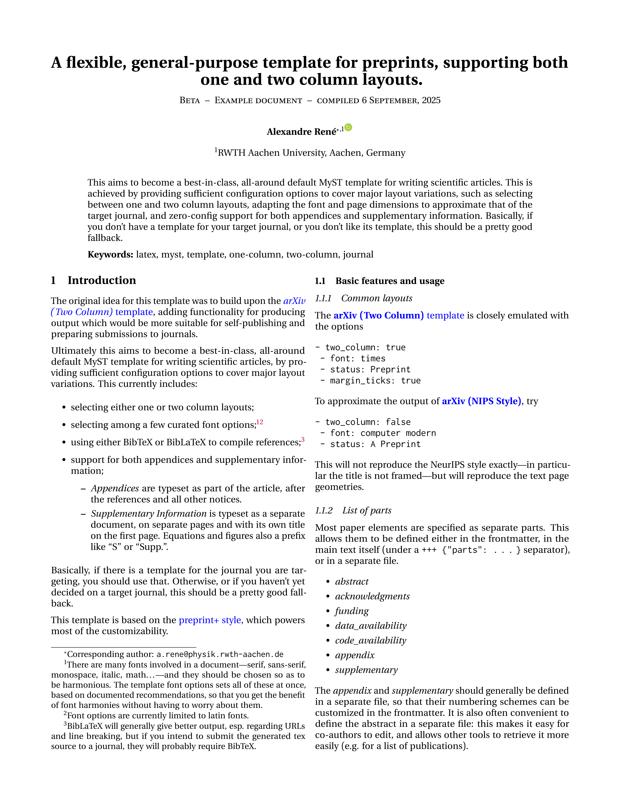

# Preprint+ — A customizable all-purpose template



Other styles can be achieved with different options (see [below](#standard-layouts)):  
[[arXiv two column]](./thumbnail_arxiv-two-col.png)
[[arXiv one column]](./thumbnail_arxiv-one-col.png)

- Author: Alexandre René
- Author Website: https://arene.ca

A clean, general purpose preprint template that doesn’t get in the way.

The original idea was to build upon the [*arXiv (Two Column)* template](https://github.com/myst-templates/arxiv_two_column), adding functionality for producing output which would be more suitable for self-publishing and preparing submissions to journals.

Ultimately this aims to become a best-in-class, all-around default MyST template for writing scientific articles, by providing sufficient configuration options to cover major layout variations. This currently includes:
- selecting either one or two column layouts;
- selecting among a few curated font options;[^fonts][^only-latin]
- using either BibTeX or BibLaTeX to compile references;[^biblatex]
- support for both appendices and supplementary information;
  - _Appendices_ are typeset as part of the article, after the references and all other notices.
  - _Supplementary Information_ is typeset as a separate document, on separate pages and with its own title on the first page. Equations and figures also acquire a prefix like “S” or “Supp.”.

Basically, if there is a template for the journal you are targeting, you should use that.
Otherwise, or if you haven’t yet decided on a target journal, this should be a pretty good fallback.

This template is based on the [preprint+ style](https://github.com/alcrene/latex-preprint-plus), which powers most of the customizability.

[^fonts]: There are many fonts involved in a document—serif, sans-serif, monospace, italic, math…—and they should be chosen so as to be harmonious. The template font options sets all of these at once, based on documented recommendations, so that you get the benefit of font harmonies without having to worry about them.

[^only-latin]: Font options are currently limited to latin fonts.

[^biblatex]: BibLaTeX will generally give better output, esp. regarding URLs and line breaking, but if you intend to submit the generated tex source to a journal, they will probably require BibTeX.

## What is different about self-publishing?

“Self-publishing” here refers to producing a personal definitive copy of a manuscript,
which might then hosted to a personal website, or uploaded to the arXiv.
Other similar contexts include producing papers for a conference without a house style, or in an educational context–basically any time we care about getting the best output possible.

This is different from a journal submissions, which will usually be post-processed anyway, so it only matters that the journal can extract the content correctly.

It is also different from the ideal output while working on a manuscript, where we might want to print additional marks, e.g. to identify when the content exceeds into the margins.

The two obvious changes we would like to apply, compared to the *arXiv (Two Column)* template, are

- Allow the removal of the “Preprint” text, which may not apply.
- Remove the tick marks indicating the margin.

This template also offers a few more relevant options, such as 
- using custom text in the info line (e.g. “Published in…”);
- using BibLaTeX for references (while retaining the ability to use BibTeX for journal submissions);
- selecting a more modern font style;
- a future-proof way of specifying the compilation date.[^today]


[^today]: Although `\date{\today}` is a common LaTeX used in templates to ensure the date indicated always accurately reflects the compilation date, arXiv [strongly discourages](https://info.arxiv.org/help/faq/today.html) use of the `\today` macro because it often recompiles documents. This is easily avoided when authoring with MyST, because the MyST builder already provides the functionality to automatically determine the date. This template makes use of that to hard-code the date in the date in the TeX source, thus getting the best of both worlds: an auto-determined date, and future-proof TeX source for uploading to the preprint server.


## What is different about submitting to journals?

There are basically two situations where you might want to use this template instead of one provided by a journal or conference:
- when the journal does not actually provide a template;
- when the provided template does not approximate the ultimate published output.
  (A particularly egregious example of this is the [NatureSpringer template](https://www.springernature.com/gp/authors/campaigns/latex-author-support), which matches neither the font face, font size nor the column width of a published Nature article.)

Why is it important that the document you produce approximate the layout of the published article? Because this affects how you prepare floats like figures and tables.
Sure you can check your figures satisfy their size requirements, but there is no substitute for just putting them in your document and seeing how they come out.[^substitute]
Even more critically, typesetting moderately complex equations correctly is outright impossible without checking how they fit in the final text column.
And even the text itself can change slightly based on the layout constraints, for example if those constraints lead to reorganizing some figures.

All this is to say, that it makes the author’s job much easier if they can just see what the final layout will approximately look like. Mostly we want to match two things:
- the width of the text column;
- and the dimensions of the fonts, especially the math fonts.

So when we say “approximate the layout”, we specifically don’t mean matching the frame or text decorations, like lines running along the header, or the special layout of info and abstract boxes on the first page.
We don’t even really need to match the font, as long as its dimensions are sufficiently well matched.[^sufficient]

It’s good to remember also that journals (in contrast to conference proceedings) don’t usually compile the tex source we send them. Instead they use it as a type of markup: they will have tex parsers on their end which extract the text elements and them through their internal publishing pipeline.
These parsers are usually very limited in terms of what TeX commands and packages they understand.

One advantage with preparing text with MyST is that we are not incentivized to use sophisticated LaTeX macros, so the tex output produced is already pretty vanilla. Nevertheless, you will still need to take care with some more HTML-centric features like admonition boxes, which may either not be supported at all, or require different packages to emulate.

The `preprint+` style provides commands for specifying title, authors and abstract which better approximate the markup style most journal templates use.
This template uses those commands, which should further ease the task of adapting the output to journal requirements.

To summarize the main changes compared to *arXiv (Two Column)* which better support journal submissions:

- Ability to change the page geometry (both the paper size and column width[^col-width])
- Ability to choose fonts which better match the dimensions of the target journal.
- Definition of abstract and author affiliations as declarative macros in the preamble, emulating most journal styles.
- Ability to use BibTeX for references. (While retaining the ability to use BibLaTeX for our own copies.)

[^substitute]: In contrast, seeing how they come out in the final layout _is_ a substitute IMO to fussing over figure size requirements. If they come out fine, who cares that they were scaled down 5% to fit the text column?

[^sufficient]: “Sufficiently well matched” here meaning that anything more accurate would not lead to a different design decision.

[^col-width]: There are not _that_ many different options that a typical author needs, so instead of making geometry completely free, we provide a few typical sizes for the text area. Currently there one for one-column layout, based on the *arxiv* template, and two for two-column layouts: one based on the *arXiv (two column)* template and another tighter layout based on *Nature* article dimensions. More can be added as needed.

## Basic features and usage

### List of parts

Most paper elements are specified as separate parts.
This allows them to be defined either in the frontmatter, in the main text itself (under a `+++ {"parts": …}` separator), or in a separate file.

- *abstract*
- *acknowledgments*
- *funding*
- *data_availability*
- *code_availability*
- *appendix*
- *supplementary*

The *appendix* and *supplementary* should generally be defined in a separate file, so that their numbering schemes can be customized in the frontmatter.
It is also often convenient to define the abstract in a separate file: this makes it easy for co-authors to edit, and allows other tools to retrieve it more easily (e.g. for a list of publications).

Usually papers will have either an appendix or a supplementary, although the template allows for both.

### Document properties

This template uses all the standard document properties except “description”. See the [MyST documentation](https://mystmd.org/jtex/document) for more information.

- `title`: Required.
- `short_title`: Optional. If provided, used instead of `title` in the running header.
- `authors`: Required
- `affiliations`: Optional.
- `keywords`: Optional. These are displayed below the abstract block.
- `bibliography`: Optional.

### List of options

The currently supported list of options.
Longer descriptions, lists of allowed values, for each option are available on the CLI: `myst templates list --tex preprint+`.
Since most of these options map to a correspond option of the [`preprint+` LaTeX style](https://github.com/alcrene/latex-preprint-plus), its descriptions may also be of use.

| Option                 | Condition             | Short description |
|------------------------|-----------------------|-------------------|
| **Metadata**         | | |
| `language`             |                       | If given, loads `babel` package |
| `compile_date`         |                       | Use "none" to prevent printing date |
| **Content**          | | |
| `status`               |                       | Short text, like “Preprint”, to be printed on each page in the running header. |
| `venue_status`         |                       | Text to be print only in the info line on the first page. |
| `supplementary_link`   |                       | Alternative to providing the Supplementary as a part. |
| `online_link`          |                       | Include a link to an online version of the article |
| `competing_interests`  |                       | Free form text |
| `supplementary_prefix` |                       | Determines how the label is printed in captions of figures and tables in the supplementary. To define how figures are referred to in the text, you still need to use the `numbering` options for the MyST frontmatter.[^supp_prefix]
| **Page dimensions**  | | |
| `papersize`            |                       | Either `letter` or `a4` |
| `two_column`           |                       | `true`: Use two columns and the geometry of [*arXiv (Two Column)*](https://github.com/myst-templates/arxiv_two_column)<br>`false`: Use single column and the geometry of [*arXiv (NIPS Style)*](https://github.com/myst-templates/arxiv_nips) |
| `text_geometry`        |                       | If the `two_column` option is not enough, combine it with different choices of page geometries. |
| **Style**            | | |
| `font`                 |                       | (default: `erewhon`) Choose one of a few sets of fonts, selected to work well together. |
| `use_biblatex`         |                       | Set to `false` to use BibTeX |
| `cite_style`           | BibLaTeX[^cur]        | Passed to BibLaTeX as the `citestyle` option |
| `bib_style`            | BibLaTeX[^cur]        | Passed to BibLaTeX as the `bibstyle` option. If undefined, the `cite_style` value is used. | 
| `separate_appendix_references`      | BibLaTeX | (default: `false`) Print references in the appendix as a separate list. |
| `separate_supplementary_references` | BibLaTeX | (default: `true`) Print references in the supplementary as a separate list. |
| **Editing helpers**  | | |
| `margin_ticks`         | `two column` geometry  | Display ticks in the four page corners to indicate margins. |
| `line_numbers`         |                       | Display line numbers |

[^supp_prefix]: This option is subject to removal, if we can find a way to use the settings from `numbering` to also set how labels are displayed in captions.

[^cur]: These are not fundamental restrictions, and could be removed in future updates.

### Font options

The font sets corresponding to each option are either based on existing templates, or on recommendations found in the main font’s own documentation.

| Option name       | Main text font | Sans      | Typewriter    | Math    |  Comment                |
|-------------------|----------------|-----------|---------------|---------|-------------------------|
| `computer modern` | CM Roman       | CM Sans   | CM Typewriter | CM Math | The classic LaTeX font. |
| `times`           | Times          | Helvetica | CM Typewriter | Times   | Settings from [*arxiv_two_column*](https://github.com/myst-templates/arxiv_two_column).<br>Uses Adobe typefaces from `txfonts` if available.<br>Math font is especially compact. |
| `erewhon`         | erewhon        | cabin     | inconsolata   | utopia  | A more modern serif font.<br>Math dimensions similar to journals. |

References: [[Overleaf: Font typefaces]](https://www.overleaf.com/learn/latex/Font_typefaces) [[LaTeX Font Catalogue]](https://tug.org/FontCatalogue/)


### Standard layouts

The [**arXiv (Two Column)** template](https://github.com/myst-templates/arxiv_two_column) is closely emulated with the options 
[[example]](./thumbnail_arxiv-two-col.png)
```yaml
- two_column: true
- font: times
- status: Preprint
- margin_ticks: true
```

To approximate the output of [**arXiv (NIPS Style)**](https://github.com/myst-templates/arxiv_nips), try
[[example]](./thumbnail_arxiv-one-col.png)
```yaml
- two_column: false
- font: computer modern
- status: A Preprint
```
This will not reproduce the NeurIPS style exactly—in particular the title is not framed—but will reproduce the text page geometries.


### Tables

Note that the capabilities for tables in MyST are still much more limited compared to LaTeX.
If you need multicolumn cells, or just to control alignment or column size, you will probably need to insert your table with the [`:::{include}` directive](https://mystmd.org/guide/tables#include-tables-from-file).
Note that you can write the external file in either HTML or LaTeX: both will be parsed by MyST internally and output to the requested format.

```myst
::::{table} Sample table title
:label: tab:table

:::{include} sample-table.tex
::::
```

If you use this approach, make sure to apply the workaround described below.

### Appendix and Supplementary

The *appendix* and *supplementary information* work in the same way.
Usually papers papers only include one, although the template allows to specify both.
The appendix will be typeset as part of the document, just at the very end, whereas the supplementary is typeset as a separate document. (Still in the same PDF, but with separate pages, its own title, etc.)
Layout options for the supplementary are also a bit more spaced, and more flexible with respect to figure placement, to better accommodate the higher figure/text ratios one usually finds in supplementary material.

(In the produced tex, the appendix is introduced with the standard `\appendix` command, whereas the supplementary is introduced with a `\supplementary` command specific to the *preprint+* style.)

Both *appendix* and *supplementary information* should be written in separate files.
Not only is this much easier for authors, but it also allows them to have their own frontmatter where we can adjust numbering.

So for example, we might have in `main.md`:
```myst
---
parts:
  appendix: appendix.md
  supplementary: supplementary.md
exports:
  - format: tex
    supplementary_prefix: "Supplementary"
---
```
then in `appendix.md`:
```myst
---
numbering:
  headings:
    template: Appendix %s
---
```
while in `supplementary.md`:
```myst
---
numbering:
  headings: false    # Ensures references use the section title instead of the number
  figure:
    template: Supplementary Figure %s
  table:
    template: Supplementary Table %s  
---
```


As far as I can tell,[^myst-1.6.0] MyST does not allow to change the identification label below figures: [the `numbering` option](https://mystmd.org/guide/cross-references#customizing-numbering-appearance) in the frontmatter only affects how they are referenced in the main text: in the supplementary itself, the figures would still be identified as “Figure 1” instead of “Supplementary Figure 1”.
This template allows to change the identification label via the `supplementary_prefix` option.[^alt-cleveref] 
I hope eventually to deprecate this option, so that the numbering format does not need to be set in two different places.

Note that as of MyST 1.6.0, defining the appendix and supplementary in separate files does cause an annoyance with figures; see below for a workaround.


[^myst-1.6.0]: As of MyST 1.6.0

[^alt-cleveref]: Alternatively, instead of setting the `numbering` option, you could add a postprocessing step which replaces all `Figure~\ref{…}` with `\cref{…}`. Then setting  `supplementary_prefix` would suffice, since the underlying `preprint+` package already configures _cleveref_  to prefix that value to all labels pointing to the supplementary.

## Workarounds

There are still a few limitations or quirks to MyST which may trip an author attempting to achieve an output matching the tex they are used to writing.

Many of these however have relatively simple workarounds which can be applied as a postprocessing step on the generated tex. All of the workarounds listed below are implemented in the [_build.sh_](./blob/main/example/build.sh) script included in the _example_ directory, which should run on Linux and MacOS. This script essentially does three things:
- Use MyST to build the tex: `myst build --tex main.md`
- Fix the tex with some text substitutions.
- Compile the tex with `latexmk -pdf main.tex`

These issues and workarounds are not specific to this template, although they are specific (or at least more relevant) for publishing scientific results in journals.
It should go without saying that every workaround below is subject to change;
I hope and expect that they will all eventually become obsolete.

### Numbering and referencing sections

As of MyST 1.6.0, the combination of “LaTeX output + [section numbering](https://mystmd.org/guide/cross-references#numbering)/[cross-references](https://mystmd.org/guide/cross-references#link-references)” does not really work as documented.
(In contrast, when producing HTML, or when configuring other targets like figure numbers, the TeX output is pretty consistent with the documentation.)

The first thing I find is that the template options for headings don’t really work: none of the following [frontmatter options](https://mystmd.org/guide/cross-references#numbering) have any effect on the produced LaTeX[^diff-html] as far as I can tell:
```myst
numbering:
  title: false/true
  headings: false/true
  heading_1: true
  heading_2:
    template: Sec %s
```
The _only_ option which has an affect on the numbering of headings is the global `true/false`:
```myst
numbering: true/false
```
If you want to set this, one strategy is to set `numbering: true` in project-level `myst.yml`, and then use the page frontmatter to set any other numbering options, such as the template for figures.
However, as we will see below, you probably want to keep the default (`numbering: false`) and instead explicitly request numbered references.

Note that the `numbering: true/false` only affects the formatting of _cross-references_: The produced tex also introduces sections with `\section{…}`, and therefore sections are always numbered in the produced PDF.[^unnumbered-sections]

To understand how cross-references come out in the final document, and how that depends on the `numbering` option, consider the following table showing the output update for each form of a markdown reference (you may assume that Section 1 is the Introduction):

| Markdown                    | `numbering: false`| `numbering: true`|
|-----------------------------|-------------------|------------------|
| `[](sec:intro)`             | Introduction      | Heading 1 |
| `[](#sec:intro)`            | Introduction      | Heading 1 |
| `[%s](#sec:intro)`          | ??                | Heading 1 |
| `[{name}](#sec:intro)`      | Introduction      | Heading 1 |
| `[Sec. %s](#sec:intro)`     | Sec. ??           | Heading 1 |
| `[Sec. {name}](#sec:intro)` | Sec. Introduction | Heading 1 |
| `@sec:intro`                | Introduction      | Heading 1 |
| ``{numref}`sec:intro` ``    | Introduction      | Heading 1 |
| ``{numref}`#sec:intro` ``   | 1                 | 1                |
| ``{numref}`Sec. %s <sec:intro>` ``  | Sec. ??   | Heading 1 |
| ``{numref}`Sec. %s <#sec:intro>` `` | Sec. 1    | Sec. 1    |
| ``{numref}`Sec. {name} <#sec:intro>` `` | Sec. name | Sec. name    |

[__Important__: With some of these forms, and in particular the otherwise most reliable form ``{numref}`Sec. %s <#sec:intro>` ``, MyST will incorrectly include a hashtag `#` in the produced LaTeX. This needs to be removed by a postprocessing step to get the results given in the table.]

The first thing to note is that `numbering: true` is something of a self-defeating option: the only cases where it _doesn’t_ hard-code the “Heading %s” pattern are already achievable with `numbering: false`. And since I’ve never seen an article refer to its sections as “See Heading 3”, I feel comfortable saying that as of MyST 1.6.0, if you care about PDF output, you should always set `numbering: false`—or don’t set it at all, since that is the default value.

Another good general recommendation is to always precede section targets with `#` (unless you use the shorthand `@` syntax): this is more robust, and not doing so will [throw a deprecation warning](https://mystmd.org/guide/cross-references#fn-1).

Beyond that, it’s a good idea to establish a convention for how to write your references, and use it consistently when writing.
There are basically three uses we need to account for: numbered references, numbered references at the beginning of a sentence,[^sentence-begin] and named references. 
Personally I find it a bit annoying that the only reliable way to get section numbers, the `{numref}` role, is also the most verbose.
So for my own writing I use a preprocessor which first converts the shorter form into a longer form using `{numref}`; if you don’t want to do this, just use the long form directly.

| What I want | Short form   | Robust (long) form | Output |
|-------------|--------------|--------------------|--------|
| normal ref  | `@sec:intro`[^shortref] | ``{numref}`section %s <#sec:intro>` `` | section 1 |
|             | `[](#sec:intro)` | ``{numref}`section %s <#sec:intro>` `` | section 1 |
| at sentence start | `[Section %s](#sec:intro)` | ``{numref}`Section %s <#sec:intro>` `` | Section 1 |
| name ref    | `[{name}](#sec:intro)` | `[{name}](#sec:intro)` (no change) | Introduction |


[^diff-html]: Again, these do seem to have an effect on HTML output, so you may still want to set them if you aim to export both to PDF and HTML.

[^unnumbered-sections]: If you want unnumbered sections, the simplest way is to define a postprocessing step which replaces `\section{` by `\section*{`. It is also possible to configure LaTeX to produce unnumbered sections—this is what *preprint+* does for sections in the supplementary—although this is more involved.

[^sentence-begin]: Typographic conventions dictate that the first word of a sentence should always be capitalized and never abbreviated.

[^shortref]: I prefer using the shorter/default forms for the most common use case, which is to produce `section %s`; this is also consistent with standard LaTeX usage. (For example, *clever*’s basic `\cref{}` command will produce something close to `section %s`, where the longer `\namecref{}` is used for name references.)

### Bare tables

MyST adds a `\bigskip` below bare tables, which can get merged with the subsequent text and cause an “Undefined command” compilation error.
Avoid this by adding a `%` comment marker below bare tables:

```myst
text

| a | b |
|---|---|
| 1 | 2 |
| 3 | 4 |
%

text
```

(Or alternatively, some regex can be used in your build pipeline to add missing spaces after `\bigskip`.)

This issue does not occur when tables are defined within a `:::{table}` directive.

### Tables with external content

Including table data from external files is not only convenient, but as described above, often necessary to achieve more complex layout.
Unfortunately, as of version 1.6.0, the LaTeX output of `include`-ed tables is someone broken: they get placed inside the caption. So instead of
```latex
\begin{table}
  \caption{Sample table title}
  \begin{tabular}{ccc}
    ...
  \end{tabular}
  \label{tab:table}
\end{table}
```
we get
```latex
\begin{table}
  \caption{Sample table title
    \begin{tabular}{ccc}
      ...
    \end{tabular}}
  \label{tab:table}
\end{table}
```

This can be fixed post-hoc by replacing
`\begin{tabular}…\end{tabular}}`
with
`}\begin{tabular}…\end{tabular}`

Note however that tables included this way are still first parsed by MyST to its internal format, which then generates new LaTeX code for the export.
This means that only features recognized by MyST will be included.

To my knowledge, there is currently no way[^other-than-raw] to specify centered columns, or horizontal rules in the  LaTeX table parser will not preserve horizontal

[^other-than-raw]: Other than wrapping the entire table with a [`:::{raw:latex}` directive](https://mystmd.org/guide/creating-pdf-documents#including-content-with-specific-exports).

### Full width figures and tables

As far as I can tell, MyST does not yet support full-width figures and tables, typically specified with the starred form:
```latex
\begin{figure*}
  ...
\end{figure*}
```
This is at least easy to fix in the tex posthoc; I recommend adding a standard comment above items which need to be made full width, to make them easier to find. For example
```myst
% Next table full width
:::{table} My wide table
...
:::
```

With a bit of regex-fu, that comment can even be used to add the starred forms automatically. (See _example/build.sh_ for an example.)

### Figures in the supplementary or appendix

External files which are referenced to in parts (such as figures) are not copied over to the build directory (see [issue #2214](https://github.com/jupyter-book/mystmd/issues/2214)).

This can be worked around by copying figure files into the build directory.

### Spurious heading level in the supplementary or appendix

Parts inserted through the frontmatter are implicitely assumed to be below a heading. Every heading within them is therefore one level deeper, so that currently the highest heading level in the Appendix and Supplementary is `\subsection`.[^subsection]

This can worked around with a simple search\&replace;[^highest-to-lowest] 
just make sure to apply substitutions from highest to lowest level.
I.e. do `\subsection` → `\section` first, _then_  `\subsubsection` → `\subsection`.

With a bit more effort it can also be automated; see again the included _build.sh_ script.

### Ugly URLs

MyST does not used `\url{<url>}` to produce URLs, but instead `\hyperref{<url>}{<url>}`. This is suboptimal for two reasons:
  + It uses the normal text font, instead of the one for URLs (typically a monospaced one).
  + Most importantly, it has very poor line breaking, because the `\hypperef` command is designed to format plain text. The `\url` command in contrast expects a URL, and can be configured to be more liberal with its line breaks.[^xurl]
  
A simple workaround is to replace every `\hyperref` command where the argument is repeated by a `\url` command.

[^xurl]: This template does this by loading the `xurl` package.

### Spurious URLs

MyST automatically recognizes URLs; basically anything of the form `text.ext`. Unfortunately this will also catch filenames, which is why _build.sh_ in the example PDF points to an unrelated web page. I don’t know of a way to turn this off, but one workaround is to format file names as code instead: `build.sh`.

## Compiling the example

The included example employs some of the aforementioned [workarounds](#Workarounds), and so should be compiled with the provided build script:

```sh
./build.sh
```

